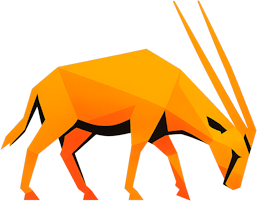

AI generated

  

  # OMA  
  ### Oryx Migration Assistant  

  **ZSA Oryx ➜ MoErgo Layout Editor**

  

---

OMA converts ZSA Oryx layouts into MoErgo-compatible layouts.

It migrates as much as possible from your existing setup and provides clear instructions for anything it can’t automatically convert.

---

## Effortless migration

OMA runs locally in your browser.

No uploads. No servers. No waiting.

Just drop in your file and get a MoErgo-ready layout.

---

## 1. Get your source

Start in ZSA Oryx.

- Open your layout  
- Click **Download Source** (the `< >` icon)  
- Save the `.zip` file locally  

Everything OMA needs is inside that file.

---

## 2. Import into OMA

Open OMA in your browser and drag in your `.zip` file.

OMA immediately begins translating your layout.

No configuration required.

---

## 3. Review changes

OMA generates a migration report.

You’ll see:

- what mapped automatically  
- what was adapted for MoErgo  
- what requires manual setup  

Most of your layouts is migrated.

Some advanced features may need a quick rebuild in MoErgo tools.

---

## 4. Export to MoErgo

Click **Download Layout**.

Then:

- Open the MoErgo Layout Editor  
- Import the `.json` file  
- Your layout is ready  

Layers preserved. Structure intact. Ready to type.

---

## What OMA handles

OMA preserves as much of your Oryx setup as possible.

- **Key Mapping** → Direct conversion to ZMK keycodes  
- **Layers** → Rebuilt with safe indexing  
- **Combos** → Geometry recalculated for new layouts  
- **Hold-Taps** → Fully preserved and translated  
- **Layer Keys** → Converted to native ZMK behaviors  
- **Media & System Keys** → Fully mapped  
- **Mouse Keys** → Translated to MoErgo controls  
- **RGB & Colors** → Converted to compatible formats  

---

## What needs attention

Some features don’t translate 1:1 across firmware systems.

- **Layer Names** ⚠️  
  They are not stored in the Oryx zip file 
  
- **Tap Dances** ⚠️  
  Rebuild using MoErgo tools  

- **Custom Macros** ⚠️  
  Recreate in ZMK macro system  

- **Oryx proprietary features** ⚠️  
  Some behaviors require manual replacement  

OMA clearly flags these so nothing is lost silently.

---

## Why OMA exists

Because switching keyboards shouldn’t mean starting over. QMK to ZMK

Your layout is muscle memory.  
OMA just moves it with you.

---

**By Moosy Research**

---

AI generated
